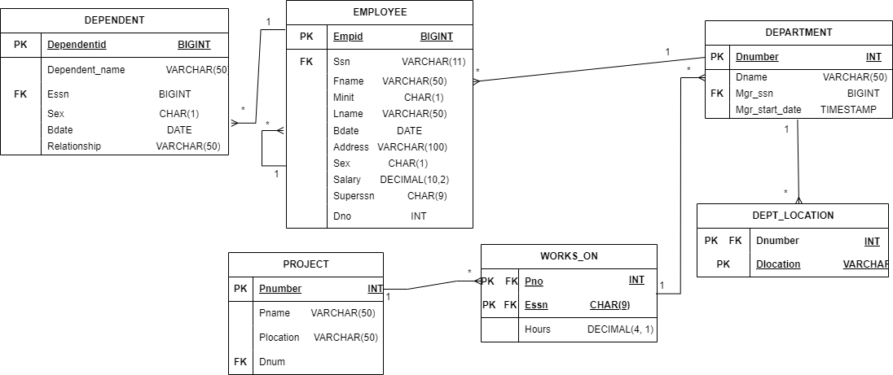

<h1>Dockerized Organizational Database Management System</h1>

This project demonstrates the setup and use of a MySQL database with a PHP interface in a Dockerized environment, aimed at managing organizational data like employees, departments, and projects. The system is built to allow easy database access and management through a series of PHP scripts, and includes additional management tools using PL/SQL scripts.

<h2>Table of Contents</h2>
<ol>
    <li><a href="#project-overview">Project Overview</a></li>
    <li><a href="#features">Features</a></li>
    <li><a href="#er-diagram">ER Diagram</a></li>
    <li><a href="#getting-started">Getting Started</a></li>
    <li><a href="#project-structure">Project Structure</a></li>
    <li><a href="#plsql-scripts">PL/SQL Scripts</a></li>
    <li><a href="#challenges">Challenges</a></li>
    <li><a href="#appendix---useful-ubuntu-commands">Appendix - Useful Ubuntu Commands</a></li>
    <li><a href="#acknowledgments">Acknowledgments</a></li>
</ol>

<h2 id="project-overview">Project Overview</h2>

This project showcases a Dockerized approach to managing organizational data through a MySQL database interfaced with PHP. Docker containers are used to encapsulate the MySQL and PHP environments, providing consistency and ease of deployment. The <code>mydatabase</code> is used to store essential information about departments, employees, and projects. Additionally, PL/SQL scripts are integrated for advanced database management tasks.

<h2 id="features">Features</h2>
<ul>
    <li><b>Dockerized Environment:</b> Isolated MySQL and PHP containers ensure smooth setup and consistent deployment.</li>
    <li><b>Web Interface via PHP Scripts:</b>
        <ul>
            <li><code>index.php</code>: Entry point linking all other scripts.</li>
            <li><code>p1.php</code>: Retrieves and displays employee details based on SSN.</li>
            <li><code>p2.php</code>: Lists all employees within a given department.</li>
            <li><code>companyBrowse.php</code>: Displays a table of all departments.</li>
            <li><code>deptView.php</code>: Provides a comprehensive view of department details, including related projects.</li>
        </ul>
    </li>
    <li><b>PL/SQL Integration:</b> Two PL/SQL scripts handle more complex data management operations within the MySQL database.</li>
</ul>

<h2 id="er-diagram">ER Diagram</h2>

The ER diagram shows relationships among the tables, including <code>Employee</code>, <code>Department</code>, <code>Project</code>, <code>Works_On</code>, <code>Dependent</code>, and <code>Dept_Location</code>. This relational model supports flexible and reliable data access and management.

<h2 id="getting-started">Getting Started</h2>

<h3>Prerequisites</h3>
<ul>
    <li><b>Docker:</b> Install Docker and Docker Compose to run the containers.</li>
    <li><b>MySQL:</b> Basic knowledge of MySQL for database operations is recommended.</li>
</ul>

<h3>Installation</h3>
<ol>
    <li><b>Clone the Repository:</b>
        <pre><code>git clone https://github.com/your-username/organizational-database-management.git
cd organizational-database-management</code></pre>
    </li>
    <li><b>Start Docker Containers:</b> Use Docker Compose to bring up the MySQL and PHP containers:
        <pre><code>docker-compose up</code></pre>
        This command initializes the MySQL and PHP services, with MySQL preconfigured for <code>mydatabase</code>.
    </li>
    <li><b>Access the Application:</b> Open your browser and go to <code>http://localhost/index.php</code> to access the interface.</li>
</ol>

<h2 id="project-structure">Project Structure</h2>
<ul>
    <li><b>docker-compose.yml:</b> Docker Compose file defining PHP and MySQL services.</li>
    <li><b>Database Initialization:</b>
        <ul>
            <li>SQL scripts to create tables and constraints.</li>
            <li>Data loading script to populate tables with data from <code>.dat</code> files.</li>
        </ul>
    </li>
    <li><b>PHP Scripts:</b>
        <ul>
            <li><code>index.php</code>: Homepage that links to other scripts.</li>
            <li><code>p1.php</code>: Retrieves employee information by SSN.</li>
            <li><code>p2.php</code>: Lists employees by department.</li>
            <li><code>companyBrowse.php</code>: Shows all departments.</li>
            <li><code>deptView.php</code>: Detailed view of a department, including projects.</li>
        </ul>
    </li>
</ul>

<h2 id="plsql-scripts">PL/SQL Scripts</h2>

Two PL/SQL scripts are included to enhance the database’s capabilities:

<ol>
    <li><b>Script 1:</b> Automates employee tenure calculation based on their join date.</li>
    <li><b>Script 2:</b> Manages departmental budgets across projects.</li>
</ol>

<h2 id="challenges">Challenges</h2>

<h3>Importing the <code>.dat</code> File</h3>

Importing data from a <code>.dat</code> file in a Dockerized MySQL environment posed some unique challenges:

<ul>
    <li><b>Volume Mapping:</b> The <code>.dat</code> file was mapped into the MySQL container using Docker volumes to make it accessible for import.</li>
    <li><b>File Path Configuration:</b> Ensuring correct file paths within the container required setting specific directory permissions.</li>
</ul>

<h3>Synchronizing PHP and MySQL</h3>

Consistency between the PHP scripts and MySQL database was essential, especially as scripts relied on prepared statements for secure data access. Multiple rounds of testing were necessary to ensure queries were executing as expected.

<h2 id="appendix---useful-ubuntu-commands">Appendix - Useful Ubuntu Commands</h2>
<ul>
    <li><b>Starting Docker:</b> <code>sudo systemctl start docker</code></li>
    <li><b>Viewing Docker Logs:</b> <code>docker logs [container_name]</code></li>
    <li><b>Listing Files in Volume:</b> <code>docker exec -it [container_name] ls /path/to/volume</code></li>
    <li><b>Accessing MySQL in Docker:</b> <code>docker exec -it [mysql_container] mysql -u root -p</code></li>
</ul>

<h2 id="acknowledgments">Acknowledgments</h2>

Special thanks to my project team and mentors for their invaluable support and guidance. This project was greatly enriched by their insights and assistance with Docker, MySQL, and PHP development.

<h2>License</h2>

This project is licensed under the MIT License. See the <a href="LICENSE">LICENSE</a> file for details.

